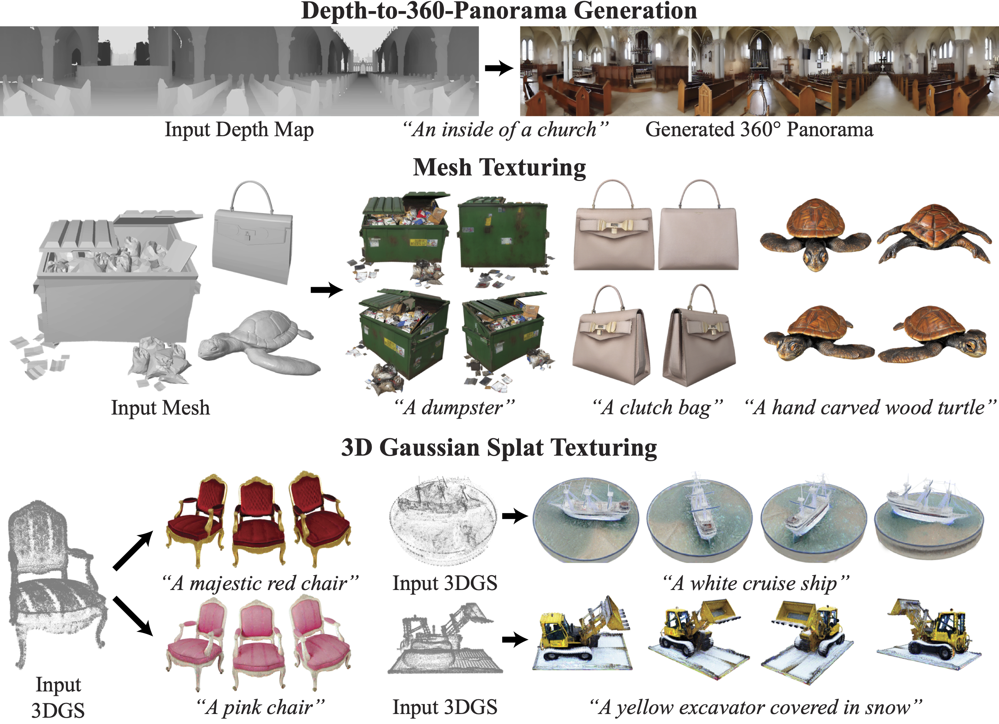

# SyncTweedies: A General Generative Framework Based on Synchronized Diffusions



[Jaihoon Kim](https://jh27kim.github.io/)\*, [Juil Koo](https://63days.github.io/)\*, [Kyeongmin Yeo]()\*, [Minhyuk Sung](https://mhsung.github.io/) (* Denotes equal contribution)

| [**Website**](https://synctweedies.github.io/) | [**Paper**](https://synctweedies.github.io/static//synctweedies.pdf) | [**arXiv**](https://arxiv.org/abs/2403.14370) |

<br />

## Introduction
This repository contains the official implementation of SyncTweedies. SyncTweedies can be applied to various downstread applications including ambiguous image generation, arbitrary-sized image generation, 360&deg; panorama generation and texturing 3D mesh and Gaussians. More results can be found at our [project webpage](https://synctweedies.github.io/). 

> We introduce a general diffusion synchronization framework for generating diverse visual content, including ambiguous images, panorama images, 3D mesh
textures, and 3D Gaussian splats textures, using a pretrained image diffusion
model. We first present an analysis of various scenarios for synchronizing multiple diffusion processes through a canonical space. Based on the analysis, we
introduce a novel synchronized diffusion method, SyncTweedies, which averages the outputs of Tweedie’s formula while conducting denoising in multiple
instance spaces. Compared to previous work that achieves synchronization through
finetuning, SyncTweedies is a zero-shot method that does not require any finetuning, preserving the rich prior of diffusion models trained on Internet-scale image
datasets without overfitting to specific domains. We verify that SyncTweedies
offers the broadest applicability to diverse applications and superior performance
compared to the previous state-of-the-art for each application.

<br />

## Environment Setup 
### Software Requirements
- Python 3.8 
- CUDA 11.7
- PyTorch 2.0.0 

```
git clone https://github.com/KAIST-Visual-AI-Group/SyncTweedies
conda env create -f environment.yml
pip install git+https://github.com/openai/CLIP.git
pip install -e .
```

<details>
<summary>3D Mesh Texturing (PyTorch3D) </summary>

```
pip install --no-index --no-cache-dir pytorch3d -f https://dl.fbaipublicfiles.com/pytorch3d/packaging/wheels/py38_cu117_pyt200/download.html
```

</details>

<details>
  <summary>3D Gaussians Texturing (Differentiable 3D Gaussian Rasterizer - gsplat) </summary>

  ```
  cd synctweedies/renderer/gaussian/gsplat
  python setup.py install
  pip install .
  ```

</details>

<br />

## Data
### 3D Mesh Texturing
Use 3D mesh and prompt pairs from [Text2Tex](https://arxiv.org/abs/2303.11396) and [TEXTure](https://arxiv.org/abs/2302.01721). 
Text2Tex uses a subset of [Objaverse dataset](https://objaverse.allenai.org/).
* 3D mesh texturing - `data/mesh/turtle.obj` (TEXTure), `data/meshclutch_bag.obj` (Text2Tex)

For 3D mesh texture editing, use the generated 3D mesh from Luma AI. 
* 3D mesh texture editing (SDEdit) - `data/mesh/sdedit/mesh.obj` (Luma AI)

### 360&deg; Panorama Generation
Use depth maps from [360MonoDepth](https://manurare.github.io/360monodepth/) to generate 360&deg; panoamra images.
* 360&deg; panoamra generation - `data/panorama`

### 3D Gaussians Texturing
Download [Synthetic NeRF dataset](https://www.matthewtancik.com/nerf) and reconstruct 3D scenes using either [3D Gaussian Splatting framework](https://github.com/graphdeco-inria/gaussian-splatting) or [gsplat](https://github.com/nerfstudio-project/gsplat). 

Use the reconstructed 3D scene for texturing 3D Gaussians.
* 3D Gaussians texturing - `data/gaussians/chair` and `data/gaussians/chair.ply`.

<br />

## Inference 
Please run the commands below to run each application. 

<details>
  <summary>Ambiguous Image</summary>
  
  <br />
  
  **1-to-1 Projection**
  
  ```python main.py --app ambiguous_image --case_num 2 --tag ambiguous_image --save_dir_now```
  
  **1-to-n Projection**
    
 ```python main.py --app ambiguous_image --case_num 2 --tag ambiguous_image --save_dir_now --views_names identity inner_rotate```

  **n-to-1 Projection**
 
  ```python main.py --app ambiguous_image --case_num 2 --tag ambiguous_image --save_dir_now --optimize_inverse_mapping```

  **--prompts** <br /><br />
  Text prompts to guide the generation process. (Provide a prompt per view)

  **--save_top_dir** <br /><br />
  Directory to save intermediate/final outputs.

  **--tag** <br /><br />
  Tag output directory.

  **--save_dir_now** <br /><br />
  Save output directory with current time.

  **--case_num** <br /><br />
  Denoising case num. Refer to the main paper for other cases. (Case 2 - SyncTweedies)

  **--seed** <br /><br />
  Random seed.

  **--views_names** <br /><br />
  View transformation to each denoising process. 

  **--rotate_angle** <br /><br />
  Rotation angle for rotation transformations.

  **--initialize_xt_from_zt** <br /><br />
  Initialize the initial random noise by projecting from the canonical space. 

  **--optimize_inverse_mapping** <br /><br />
  Use optimization for projection operation. (n-to-1 projection)
  
</details>

<details>
  <summary>Arbitrary-sized Image</summary>
  
  <br />

  ```
  python main.py --app wide_image --prompt "A photo of a mountain range at twilight" --save_top_dir ./output --save_dir_now --tag wide_image --case_num 2 --seed 0 --sampling_method ddim --num_inference_steps 50 --panorama_height 512 --panorama_width 3072 --mvd_end 1.0 --initialize_xt_from_zt 
  ```

  **--prompts** <br /><br />
  Text prompts to guide the generation process.

  **--save_top_dir** <br /><br />
  Directory to save intermediate/final outputs.

  **--tag** <br /><br />
  Tag output directory.

  **--save_dir_now** <br /><br />
  Save output directory with current time.

  **--case_num** <br /><br />
  Denoising case num. Refer to the main paper for other cases. (Case 2 - SyncTweedies)

  **--seed** <br /><br />
  Random seed.

  **--sampling_method** <br /><br />
  Denoising sampling method.

  **--num_inference_steps** <br /><br />
  Number of sampling steps.

  **--panorama_height** <br /><br />
  The height of the image to generate.

  **--panorama_width** <br /><br />
  The width of the image to generate.

  **--mvd_end** <br /><br />
  Step to stop the synchronization. (1.0 - Synchronize all timesteps, 0.0 - No synchronizaiton)

  **--initialize_xt_from_zt** <br /><br />
  Initialize the initial random noise by projecting from the canonical space. 
  
</details>

<details>
  <summary>3D Mesh Texturing</summary>
  
  <br />

  ```
  python main.py --app mesh --prompt "A hand carved wood turtle" --save_top_dir ./output --tag mesh  --save_dir_now --case_num 2 --mesh ./data/mesh/turtle.obj --seed 0 --sampling_method ddim --initialize_xt_from_zt
  ```

  **--prompts** <br /><br />
  Text prompts to guide the generation process.

  **--save_top_dir** <br /><br />
  Directory to save intermediate/final outputs.

  **--tag** <br /><br />
  Tag output directory.

  **--save_dir_now** <br /><br />
  Save output directory with current time.

  **--case_num** <br /><br />
  Denoising case num. Refer to the main paper for other cases. (Case 2 - SyncTweedies)

  **--mesh** <br /><br />
  Path to input 3D mesh. 

  **--seed** <br /><br />
  Random seed.

  **--sampling_method** <br /><br />
  Denoising sampling method.

  **--initialize_xt_from_zt** <br /><br />
  Initialize the initial random noise by projecting from the canonical space. 

  **--steps** <br /><br />
  Number of sampling steps.

  ### 3D Mesh Texture Editing 

  ```
  python main.py --app mesh --prompt "lantern" --save_top_dir ./output --tag mesh  --save_dir_now --case_num 2 --mesh ./data/mesh/sdedit/mesh.obj --seed 0 --sampling_method ddim --initialize_xt_from_zt --sdedit --sdedit_prompt "A Chinese style lantern" --sdedit_timestep 0.2
  ```

  **--sdedit** <br /><br />
  Editing 3D mesh texture.

  **--sdedit_prompt** <br /><br />
  Target editing prompt. This overrides the original prompt. 

  **--sdedit_timestep** <br /><br />
  Timestep to add noise. (1.0 - x_0, 0.0 - x_T)
  
  
</details>

<details>
  <summary>360&deg; Panorama</summary>

  <br />

  ```
  python main.py --app panorama --tag panorama --save_top_dir ./output --save_dir_now --prompt "An old looking library" --depth_data_path ./data/panorama/cf726b6c0144425282245b34fc4efdca_depth.dpt --case_num 2 --average_rgb --initialize_xt_from_zt --model controlnet
  ```

  **--prompts** <br /><br />
  Text prompts to guide the generation process.

  **--save_top_dir** <br /><br />
  Directory to save intermediate/final outputs.

  **--tag** <br /><br />
  Tag output directory.

  **--save_dir_now** <br /><br />
  Save output directory with current time.

  **--depth_data_path** <br /><br />
  Path to depth map image. 

  **--case_num** <br /><br />
  Denoising case num. Refer to the main paper for other cases. (Case 2 - SyncTweedies)

  **--mesh** <br /><br />
  Path to input 3D mesh. 

  **--seed** <br /><br />
  Random seed.

  **--sampling_method** <br /><br />
  Denoising sampling method.

  **--initialize_xt_from_zt** <br /><br />
  Initialize the initial random noise by projecting from the canonical space. 

  **--steps** <br /><br />
  Number of sampling steps.

  **--canonical_rgb_h** <br /><br />
  Resolution (height) of the RGB canonical space.

  **--canonical_rgb_w** <br /><br />
  Resolution (width) of the RGB canonical space.

  **--canonical_latent_h** <br /><br />
  Resolution (width) of the latent canonical space.

  **--canonical_latent_w** <br /><br />
  Resolution (width) of the latent canonical space.

  **--instance_latent_size** <br /><br />
  Resolution of the latent instance space.

  **--instance_rgb_size** <br /><br />
  Resolution of the RGB instance space.

  **--theta_range** <br /><br />
  Azimuthal range (0-360)

  **--theta_interval** <br /><br />
  Interval of the azimuth. 

  **--FOV** <br /><br />
  Resolution of the RGB instance space.

  **--average_rgb** <br /><br />
  Perform averaging in the RGB domain (Only valid for Case 2 and Case 5).
  
  
</details>

<details>
  <summary>3D Gaussians Texturing</summary>

  <br />

  ```
  python main.py --app gs --tag gs --save_dir_now --save_top_dir ./output --prompt "A photo of majestic red throne, adorned with gold accents" --source_path ./data/gaussians/chair --plyfile ./data/gaussians/chair.ply --dataset_type blender --case_num 2 --zt_init --force_clean_composition 
  ```

  **--prompts** <br /><br />
  Text prompts to guide the generation process.

  **--save_top_dir** <br /><br />
  Directory to save intermediate/final outputs.

  **--tag** <br /><br />
  Tag output directory.

  **--save_dir_now** <br /><br />
  Save output directory with current time.

  **--case_num** <br /><br />
  Denoising case num. Refer to the main paper for other cases. (Case 2 - SyncTweedies)

  **--source_path** <br /><br />
  Path to input dataset (Refer to 3D Gaussian Splatting repo for data format).

  **--plyfile** <br /><br />
  Path to 3D Gaussians model plyfile.

  **--dataset_type** <br /><br />
  Input dataset type {colmap, blender}. 

  **--zt_init** <br /><br />
  Initialize the initial random noise by projecting from the canonical space. 

  **--no-antialiased** <br /><br />
  Used for 3D scenes trained with 3D Gaussian Splatting framework. Do not provide this option when using 3D scenes reconstructed with gsplat.
  
  
  
</details>

<br />

## Citation
```
@article{kim2024synctweedies,
  title={SyncTweedies: A General Generative Framework Based on Synchronized Diffusions},
  author={Kim, Jaihoon and Koo, Juil and Yeo, Kyeongmin and Sung, Minhyuk},
  journal={arXiv preprint arXiv:2403.14370},
  year={2024}
}
```

<br />

## Acknowledgement 
This repository is based on [Visual Anagrams](https://github.com/dangeng/visual_anagrams), [SyncMVD](https://github.com/LIU-Yuxin/SyncMVD), and [gsplat](https://github.com/nerfstudio-project/gsplat). We thank the authors for publicly releasing their codes.
